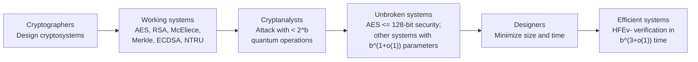

# Note

## Issue

- HQC property, why need code-based KEM

## [What Is Post-Quantum Cryptography? — NIST](https://www.nist.gov/cybersecurity-and-privacy/what-post-quantum-cryptography)

- To counter this looming threat, we need encryption methods that can stave off cyberattacks by both the conventional computers we know today and the quantum computers of tomorrow. These new methods are called **post-quantum encryption algorithms**.
- Instead of requiring a computer to factor large numbers, **lattice and hash problems** use other types of math that experts believe will be hard to solve for quantum computers and conventional computers alike.
- Quantum computers employing many **thousands of qubits** will be needed to break present-day encryption.
- Even if an adversary can’t crack the encryption that protects our secrets at the moment, it could still be beneficial to capture encrypted data and hold onto it, in the hopes that a quantum computer will break the encryption down the road. This idea is sometimes expressed as “**harvest now, decrypt later**” — and it’s one of the reasons computers need to start encrypting data with post-quantum techniques as soon as possible.
- NIST has encouraged the world’s cryptographers to look at how the candidate algorithms work not only in big computers and smartphones, but also in devices that have limited processor power. Smart cards, tiny devices such as smart kitchen appliances for use in the **Internet of Things**, and individual microchips all need quantum-resistant algorithms too.

## [Post-Quantum Cryptography - 2008](https://link.springer.com/book/10.1007/978-3-540-88702-7) 

- A closer look reveals, however, that there is no justification for the leap from “quantum computers destroy **RSA and DSA and ECDSA**” to “quantum computers destroy cryptography.”
- Grover’s algorithm forces somewhat larger key sizes for secret-key ciphers, but this effect is essentially uniform across ciphers; today’s fastest pre-quantum **256-bit ciphers** are also the fastest candidates for post-quantum ciphers at a **reasonable security level**. 
- I chose to focus on public-key examples—a focus shared by most of this book—because quantum computers seem to have very little effect on secret-key cryptography, hash functions, etc. Grover’s algorithm forces somewhat larger key sizes for secret-key ciphers, but this effect is essentially **uniform across ciphers**; today’s fastest pre-quantum 256-bit ciphers are also the fastest candidates for post-quantum ciphers at a reasonable security level. **if ture until 2026 years**

### RSA factorization attacks -- example

For an attack budget of $2^b$ operations, the corresponding RSA modulus size is asymptotically:

| Year | Attack | Computer | RSA modulus bit length for about $2^b$ work |
|---|---|---|---|
| 1978 | Schroeppel's linear sieve | Classical | $(0.5 + o(1))b^2 / \lg b$ bits |
| 1988 | Number-field sieve | Classical | $(0.016\ldots + o(1))b^3 / (\lg b)^2$ bits |
| 1994 | Shor's algorithm | Quantum | $2^{(0.5 + o(1))b}$ bits |

Thus, classical key sizes grow polynomially with the desired security level, whereas resisting Shor's algorithm would require an impractically exponential RSA key size. These are asymptotic formulas: the $o(1)$ terms and implementation constants matter greatly at practical security levels such as $b=128$.

### Post-quantum cryptography landscape

The exponents are simplified asymptotic notation. Concrete parameter sizes and performance require a more detailed analysis for each security level.
